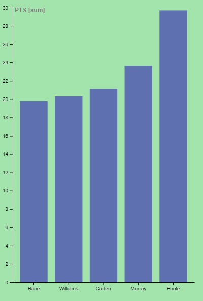
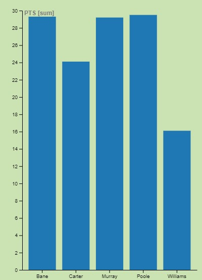
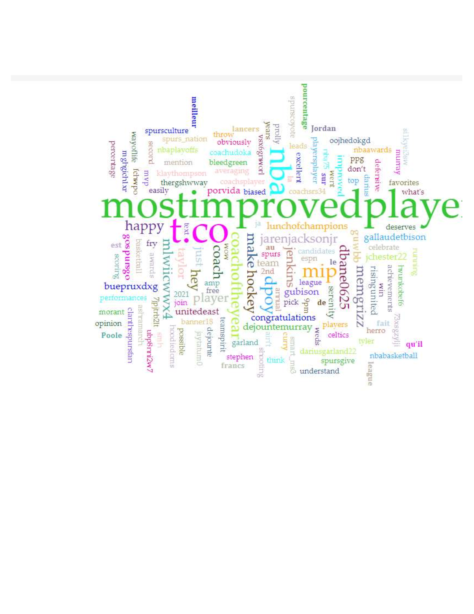

# NBA 
## Who deserves the Most Improved Player Award? 
### ae20ko
### 2P02
### Aaron Mauro 
### 2022-04-12
 

# Abstract

This report uses NBA stats to show who out of the seven players mentioned in the NBA Award Ballot for the Most Improved Player award deserves it. Based on the stats on their first/previous season/s compared to the current one, as well as how much did they help their team win. Unlike the MVP award, there are many names involved in the MIP conversation, this report will show who out of the seven deserves the award, it could also serve as a prediction. I will be using their points and assists per game, minutes played	 as well as win percentage to measure their improvement over the season/s they played. 

 
 

# Introduction
The NBA has many different types of awards for all kinds of players, the ones that attract the most interest are the MVP (*most valuable player*), Finals MVP, and DPOTY (*defensive player of the year*) because they are the most prestigious awards. But I believe that picking the right MVP could be a lot easier than picking the MIP (*most improved player*), that is because there aren’t as many players fighting for the MVP spot, also it’s easy to fall out of the MVP conversation if the player and his team aren’t winning as many games as the other candidates. There are many names in the MIP conversation, the NBA Award Ballot mentions about 7 of them. Though the ballots are here, the awards don’t get announced until after the NBA finals in June, personally, I cannot wait until then. The names mentioned on the ballot are *Darius Garland, Ja Morant, Robert Williams III, Wendell Carter Jr, Jordan Poole, Desmond Bane, and Dejounte Murray*. They all played very well this season, however, some of them have been in the league for longer than others. For instance, Jordan Poole was drafted in 2019, he played a total of three seasons for the Golden State Warriors; However, Dejounte Murray was drafted in 2016, and he has played six seasons in the NBA, twice longer than Poole, but does that mean he should be disregarded? Though there are seven candidates in the MIP conversation, I believe that high lottery picks that eventually improve should not be counted, Murray was a 1st-round 29th pick, which is why it would be impressive if he would improve to be the franchise player he is today. For instance, Ja Morant was drafted in 2019 but he was the 1st round 2nd pick, he also won the Rookie of the year award that season. A player like him improving on his 3rd season is not a surprise at all, he’s been terrific every season he played, so I believe that his name should be with the MVP candidates, not the MIP, high lottery picks that improve should not be counted, though some high lottery picks don’t improve, it is still what’s expected of them, same goes with Darius Garland. That leaves us with 5 MIP candidates. Another important factor to think about in order to pick the MIP is playing time compared to points per game, if the players’ minutes increased but his average point per game has not then that would not be an impressive improvement, let’s look at this from different angles.

 
 

# Methods
 

 
Above is a bar chart made by RAWGraphs that shows the MIP award candidates' 2020-2021 NBA season (last season). The group is led By Jordan Poole who averaged 30 points per game, last season was a great one for Poole if you compare it to his rookie season. Regardless of the number of points he had in comparison to other candidates, others could have had a bigger improvement. Below is another bar chart but from this current season (2021-2022), it shows that the group is still led by Jordan Poole, however, if you compare the charts Jordan Poole is not the most improved out of the five mentioned, though his point per games is high in comparison I believe that Bane, Carter and Murray improved by a large margin. Basketball is a sport driven by its fans, it is completely possible that the player chosen to be the MIP might outrage the fans, some might think that someone else deserved it. In order to really see the point of view of the fans, I’ve made a Voyant map out of Twitter tags, as Twitter is a great way for fans to interact with players and each other, I’ve put (most improved player) in the search bar. It shows a split between Poole and Murray, many fans think it’s Jordan Poole and many others think it’s Murray. 

 
 

 

# Results 

I mentioned that Jordan Poole has been averaging 30 pts since his second season, but the late pick Murray has been improving and playing well as the spurs franchise player, because of this. I believe that Murray also deserves the most improved player award. 

# Discussion 
The first two bar charts helped us see the bigger picture and notice the improvement of each player but only statistically.  On the court, it is a whole different story. The fans also have a great impact on the game of basketball, my decision was based on stats and fans.
It ultimately falls between Poole and Murray, though I think Bane and Williams did great I still don’t believe they’ve had a bigger impact than Murray and Poole. Poole had a great season; he was matching the all-star teammates by playing like an all-star himself. The same goes with Murray, who stepped up and became of the Spurs’ star players allowing them to trust him as their franchise player and help them win, I believe that those two will have great futures in the NBA as both still have many seasons ahead of them. After the finals the NBA will reveal who its most improved player really is, and I would be shocked if it was not either Dejounte Murray or Jordan Poole.

# Works Cited 

*Kalbrosky, B. (2022, March 29). Jordan Poole should be NBA most improved player. maybe he'll convince you in the postseason. USA Today. Retrieved April 16, 2022, from https://ftw.usatoday.com/2022/03/warriors-jordan-poole-nba-awards-most-improved*

*Salah, A. J. (2022, April 14). NBA most improved player odds - hunger for morant. Covers.com. Retrieved April 16, 2022, from https://www.covers.com/nba/most-improved-player-odds*

